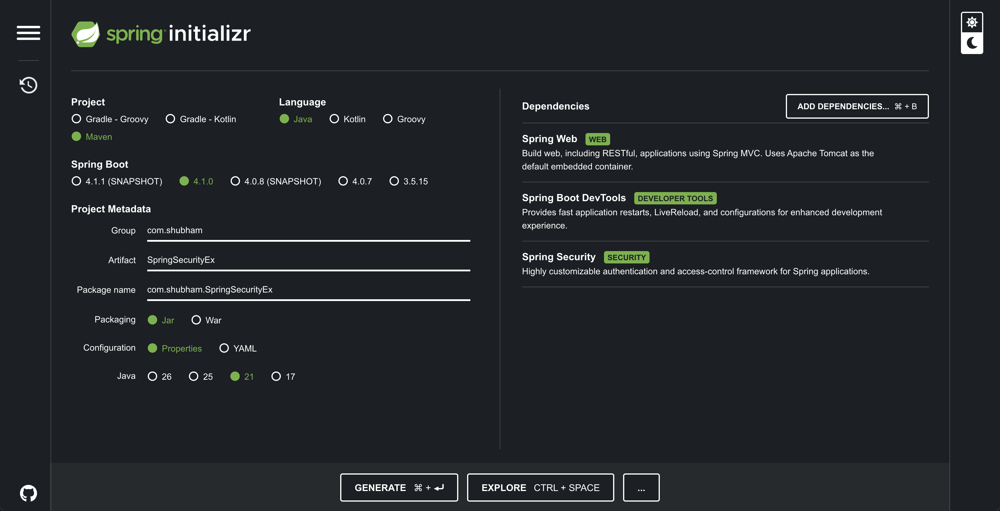

# Spring Security with JWT & PostgreSQL (Learning Project)



This project demonstrates how to secure a Spring Boot application using **Spring Security** and **JSON Web Tokens (JWT)**, backed by a **PostgreSQL** database for user storage.

This `README` is specifically designed as a learning resource, documenting not only the code and syntax but also the common errors we encountered and how we fixed them.

---

## 1. Local Database Setup (macOS)

This project connects to a local PostgreSQL database. If you don't have it set up, here is how you install and configure it from scratch using Homebrew.

### Installation

Run the following command to install PostgreSQL 18:

```bash
brew install postgresql@18
brew services start postgresql@18
```

### Database & User Creation (The SQL Queries)

By default, the application is configured to connect to a database named `shubhamd` using the user `postgres` with the password `0000`.

To set this up, open your terminal and connect to the default Postgres database:

```bash
psql postgres
```

Then, run the following SQL queries exactly as written:

```sql
-- 1. Create the user with the required password
CREATE USER postgres WITH PASSWORD '0000';

-- 2. Create the database and assign ownership to our new user
CREATE DATABASE shubhamd OWNER postgres;
```

---

## 2. Spring Boot Configuration (`application.properties`)

```properties
spring.datasource.url=jdbc:postgresql://localhost:5432/shubhamd
spring.datasource.username=postgres
spring.datasource.password=0000
spring.datasource.driver-class-name=org.postgresql.Driver
spring.jpa.database-platform=org.hibernate.dialect.PostgreSQLDialect
spring.jpa.hibernate.ddl-auto=update
```

**Why we added `spring.jpa.database-platform`**:
Initially, we encountered the error: _"Unable to determine Dialect without JDBC metadata"_. This happens when Hibernate fails to detect the database type automatically. We fixed it by explicitly telling Spring Boot to use the PostgreSQL dialect.

---

## 3. JWT Dependencies (`pom.xml`)

To work with JWTs, we added the `io.jsonwebtoken` (JJWT) library.

```xml
<dependency>
    <groupId>io.jsonwebtoken</groupId>
    <artifactId>jjwt-api</artifactId>
    <version>0.13.0</version>
</dependency>
<dependency>
    <groupId>io.jsonwebtoken</groupId>
    <artifactId>jjwt-impl</artifactId>
    <version>0.13.0</version>
    <scope>runtime</scope>
</dependency>
<dependency>
    <groupId>io.jsonwebtoken</groupId>
    <artifactId>jjwt-jackson</artifactId>
    <version>0.13.0</version>
    <scope>runtime</scope>
</dependency>
```

**Common Mistakes We Fixed Here:**

1. **Wrong Scope:** Initially, `jjwt-api` had `<scope>test</scope>`. This meant the JWT classes couldn't be used in our main application code. We removed it so it defaults to `compile` scope.
2. **Missing Jackson:** We had to manually add `jjwt-jackson`. Without it, the JWT library cannot serialize or parse JSON payloads.

---

## 4. Entity Mapping & The Reserved Keyword Issue

```java
import jakarta.persistence.Entity;
import jakarta.persistence.Id;
import jakarta.persistence.Table;

@Entity
@Table(name = "users")
public class User {
    @Id
    private int id;
    private String username;
    private String password;
}
```

**Why `@Table(name = "users")` is critical:**
When we first ran the app, we got this error: `ERROR: syntax error at or near "user"`.
This happened because `user` is a **reserved keyword** in PostgreSQL. By default, Hibernate tries to name the table exactly after the class (`User`). We fixed this by adding `@Table(name = "users")` to explicitly tell Postgres to name the table `users`, bypassing the keyword conflict.

---

## 5. Spring Security Configuration (`SecurityConfig.java`)

The `SecurityConfig` class is the heart of our application's security.

```java
@Configuration
@EnableWebSecurity
public class SecurityConfig {

    @Autowired
    private JwtFilter jwtFilter;

    @Bean
    public SecurityFilterChain securityFilterChain(HttpSecurity http) throws Exception {
        return http
                .csrf(customizer -> customizer.disable())
                .authorizeHttpRequests(request -> request
                        .requestMatchers("/register", "/login").permitAll()
                        .anyRequest().authenticated())
                .sessionManagement(session -> session.sessionCreationPolicy(SessionCreationPolicy.STATELESS))
                .addFilterBefore(jwtFilter, UsernamePasswordAuthenticationFilter.class)
                .build();
    }
}
```

### Explaining the Syntax & Fixes

- **`@EnableWebSecurity`**: Tells Spring Boot that this class contains custom security rules, overriding the default security configurations.
- **`csrf().disable()`**: Disables Cross-Site Request Forgery protection. We do this because we are using stateless JWTs instead of browser cookies.
- **`.requestMatchers("/register", "/login")`**: Defines endpoints that are publicly accessible (`.permitAll()`).
  - _Error we fixed:_ Initially, we wrote `"register", "login"`. Spring Security crashed with `pattern must start with a /`. We fixed it by adding the leading slashes.
- **`sessionCreationPolicy(SessionCreationPolicy.STATELESS)`**: Ensures our REST API does not save user sessions on the server (no Session IDs). Every single request must be independently authenticated using a JWT.
- **`.addFilterBefore(jwtFilter, UsernamePasswordAuthenticationFilter.class)`**: Injects our custom JWT validation filter into the security chain.
  - _Error we fixed:_ We originally used `.addFilter(jwtFilter)`. This caused an error: _"JwtFilter does not have a registered order"_. Spring Security didn't know _where_ to put our filter. We fixed it by explicitly placing it _before_ the standard Username/Password filter.

---

## 6. Deep Dive into the Code Details

Here is an explanation of every major component we wrote to make this JWT Authentication system work.

### A. The Controller (`UserController.java`)

This handles the HTTP requests for `/register` and `/login`.

```java
@RestController
public class UserController {
    @Autowired
    private UserService service;
    private final BCryptPasswordEncoder encoder = new BCryptPasswordEncoder(12);

    @PostMapping("/register")
    public User register(@RequestBody User user) {
        user.setPassword(encoder.encode(user.getPassword()));
        return service.register(user);
    }

    @PostMapping("/login")
    public String login(@RequestBody User user) {
        return service.verify(user); // Returns the JWT Token
    }
}
```

- **`BCryptPasswordEncoder`**: We use this to hash the user's password _before_ saving it to the database. We use a strength of `12`. Passwords should never be stored in plain text!
- **`@RequestBody`**: Maps the incoming JSON data from the HTTP request into a `User` Java object.

### B. The User Service (`UserService.java`)

This acts as the bridge between our Controller and the Database/Security layers.

```java
public String verify(User user) {
    Authentication authentication = authenticationManager.authenticate(
            new UsernamePasswordAuthenticationToken(user.getUsername(), user.getPassword())
    );
    if (authentication.isAuthenticated()) {
        return jwtService.generateToken(user.getUsername());
    }
    return "Failed";
}
```

- **`authenticationManager.authenticate(...)`**: This tells Spring Security to take the provided username and password and verify them against the database.
- **`jwtService.generateToken(...)`**: If authentication passes, we generate and return a fresh JWT string to the user.

### C. Integrating with the Database (`MyUserDetailsService.java` & `UserPrincipal.java`)

Spring Security doesn't know about our custom `User` class. It only understands a specific interface called `UserDetails`.

**1. `UserPrincipal.java`**
We create a wrapper class that implements `UserDetails` and holds our custom `User` object.

```java
public class UserPrincipal implements UserDetails {
    private User user;

    // Spring Security calls these methods to check the user's credentials and status
    @Override
    public String getPassword() { return this.user.getPassword(); }

    @Override
    public String getUsername() { return this.user.getUsername(); }

    // Hardcoded roles for this example
    @Override
    public Collection<? extends GrantedAuthority> getAuthorities() {
        return Collections.singleton(new SimpleGrantedAuthority("ROLE"));
    }
    // ...
}
```

**2. `MyUserDetailsService.java`**
We implement `UserDetailsService` to tell Spring Security exactly _how_ to fetch a user from our database.

```java
@Service
public class MyUserDetailsService implements UserDetailsService {
    @Autowired
    private UserRepo repo;

    @Override
    public UserDetails loadUserByUsername(String username) throws UsernameNotFoundException {
        User user = repo.findByUsername(username); // Fetch from Postgres
        if (user == null) {
            throw new UsernameNotFoundException("User not found");
        }
        return new UserPrincipal(user); // Wrap in UserDetails
    }
}
```

### D. The JWT Generation & Validation (`JWTService.java`)

This service uses the `jjwt` library to cryptographically sign and decode our tokens.

```java
public JWTService() {
    KeyGenerator keyGenerator = KeyGenerator.getInstance("HmacSHA256");
    SecretKey sk = keyGenerator.generateKey();
    secretKey = Base64.getEncoder().encodeToString(sk.getEncoded());
}
```

- **`KeyGenerator`**: When the application starts, this generates a strong, random 256-bit secret key used to sign the tokens. _Note: In production, this key should be loaded from environment variables rather than generated randomly on startup, otherwise all users will be logged out whenever the server restarts._

```java
public String generateToken(String username) {
    return Jwts.builder()
            .subject(username)
            .issuedAt(new Date(System.currentTimeMillis()))
            .expiration(new Date(System.currentTimeMillis() + 60 * 60 * 10 * 1000)) // 10 hours
            .signWith(getKey())
            .compact();
}
```

- **`Jwts.builder()`**: Constructs the token, setting the `subject` (who the token belongs to) and when it expires.

### E. The JWT Filter (`JwtFilter.java`)

This is the bouncer for our API. It intercepts every single request to check if a valid token is present.

```java
@Component
public class JwtFilter extends OncePerRequestFilter {

    @Override
    protected void doFilterInternal(HttpServletRequest request, HttpServletResponse response, FilterChain filterChain) {
        String authHeader = request.getHeader("Authorization");

        // 1. Check if the Authorization header contains a Bearer token
        if (authHeader != null && authHeader.startsWith("Bearer ")) {
            String token = authHeader.substring(7);
            String username = jwtService.extractUserName(token);

            // 2. If token is valid and user isn't already authenticated in this thread
            if (username != null && SecurityContextHolder.getContext().getAuthentication() == null) {
                UserDetails userDetails = context.getBean(MyUserDetailsService.class).loadUserByUsername(username);

                // 3. Validate the token cryptographically
                if (jwtService.validateToken(token, userDetails)) {
                    // 4. Create an authentication object and tell Spring Security the user is authenticated
                    UsernamePasswordAuthenticationToken authToken = new UsernamePasswordAuthenticationToken(
                            userDetails, null, userDetails.getAuthorities()
                    );
                    SecurityContextHolder.getContext().setAuthentication(authToken);
                }
            }
        }
        // 5. Continue processing the request
        filterChain.doFilter(request, response);
    }
}
```

- **`OncePerRequestFilter`**: Ensures this filter only runs exactly once per HTTP request.
- **`request.getHeader("Authorization")`**: Grabs the token from the HTTP headers. The standard format is `Authorization: Bearer <token>`.
- **`SecurityContextHolder`**: This is where Spring Security stores the authentication details for the current request thread. If we successfully validate the JWT, we place an `AuthenticationToken` here, and Spring Security will allow the request to access protected routes!

### F. Testing the API (`StudentController.java` & `HelloController.java`)

These controllers provide endpoints to actually test if our security works.

**1. `HelloController.java`**

```java
@RestController
public class HelloController {
    @GetMapping("/")
    public String greet(HttpServletRequest request) {
        return "Welcome! " + request.getSession().getId();
    }
}
```

- **`getSession().getId()`**: Even though we configured `STATELESS` sessions in `SecurityConfig`, printing the Session ID is a great way to verify that a new session is created every single time (proving statelessness) rather than reusing an old one.

**2. `StudentController.java`**

```java
@RestController
public class StudentController {
    private final List<Student> students = new ArrayList<>(...);

    @GetMapping("/students")
    public List<Student> getStudents() { return students; }

    @GetMapping("csrf-token")
    public CsrfToken getCsrfToken(HttpServletRequest request) {
        return (CsrfToken) request.getAttribute("_csrf");
    }

    @PostMapping("/students")
    public Student addStudent(@RequestBody Student student) {
        students.add(student);
        return student;
    }
}
```

- **`getCsrfToken`**: Since we disabled CSRF in `SecurityConfig`, we don't strictly need this anymore. But earlier in the learning process, hitting this endpoint showed us the token required to make `POST` requests when default Spring Security (which enables CSRF by default) was active.

### G. The Database Interface (`UserRepo.java`)

```java
@Repository
public interface UserRepo extends JpaRepository<User, Integer> {
    User findByUsername(String username);
}
```

- **`JpaRepository<User, Integer>`**: Gives us free database methods (`save()`, `findById()`, etc.) without writing any SQL.
- **`findByUsername(String username)`**: Spring Data JPA is incredibly smart. Just by naming the method `findByUsername`, it automatically writes the SQL query `SELECT * FROM users WHERE username = ?` for us in the background!
