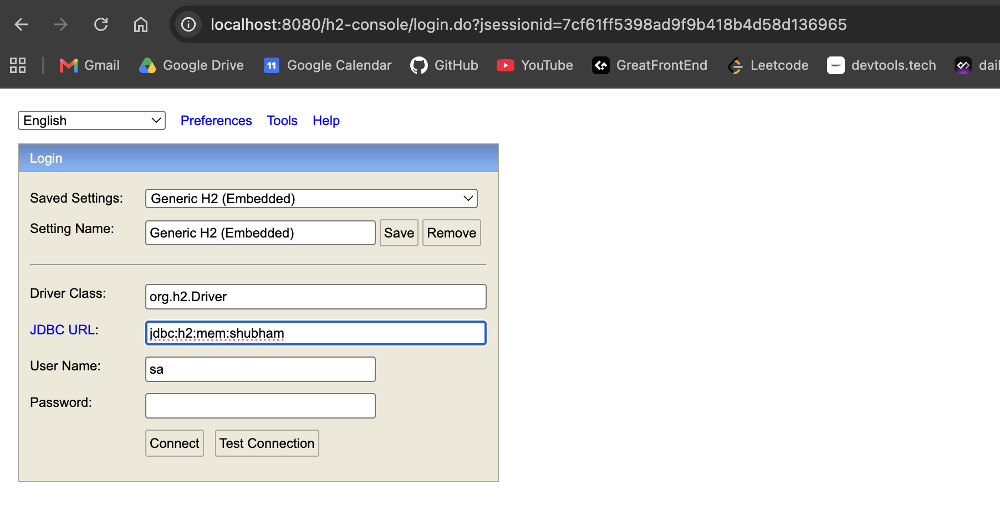
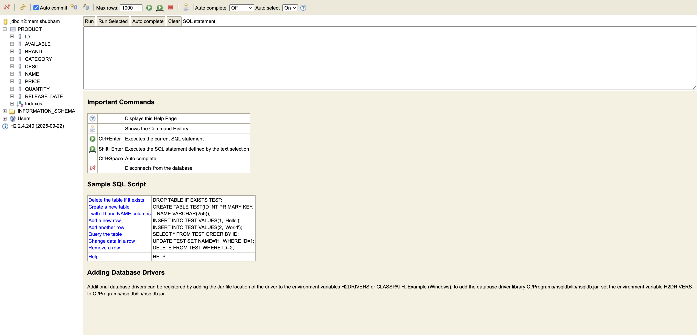

# E-Commerce Spring Boot Application (Learning Project)

This project is a fully functional E-Commerce backend built using **Spring Boot**. It is designed to serve as a comprehensive learning resource for understanding Spring Boot's core concepts, including building REST APIs, managing database transactions with Spring Data JPA, handling file uploads, and writing custom queries.

## Table of Contents
- [Project Features](#project-features)
- [Project Structure (What Files Mean What)](#project-structure-what-files-mean-what)
- [Architecture](#architecture)
- [Spring Boot Annotations Explained (Code Syntax & Why it's used)](#spring-boot-annotations-explained)
  - [1. Model Layer (Entities)](#1-model-layer-entities)
  - [2. Repository Layer (Data Access)](#2-repository-layer-data-access)
  - [3. Service Layer (Business Logic)](#3-service-layer-business-logic)
  - [4. Controller Layer (REST APIs)](#4-controller-layer-rest-apis)
- [Database Screenshots](#database-screenshots)
- [How to Run](#how-to-run)

---

## Project Features
* **CRUD Operations:** Create, Read, Update, and Delete products.
* **File Handling:** Upload and retrieve product images directly to/from the database using `byte[]`.
* **Search Functionality:** Search for products by keyword (matches name or brand) using a custom JPQL query.
* **Cross-Origin Resource Sharing:** Configured to accept requests from frontend applications.

---

## Project Structure (What Files Mean What)

Here is a breakdown of the key files and directories in this project and their responsibilities:

*   **`src/main/java/com/shubham/ecom_proj/EcomProjApplication.java`**: The main entry point of the Spring Boot application. It contains the `main` method and the `@SpringBootApplication` annotation, which bootstraps the entire application and starts the embedded web server (Tomcat).
*   **`src/main/java/com/shubham/ecom_proj/controller/ProductController.java`**: The Controller class. It exposes the REST endpoints (URLs like `/api/products`), processes incoming HTTP requests from clients, delegates work to the Service, and returns the HTTP responses.
*   **`src/main/java/com/shubham/ecom_proj/service/ProductService.java`**: The Service class. It contains all the core business logic. The controller calls methods in this class to process data before interacting with the database.
*   **`src/main/java/com/shubham/ecom_proj/repo/ProductRepo.java`**: The Repository interface. It extends `JpaRepository` and acts as the data access layer. It provides methods to communicate with the database (save, find, delete, etc.) without having to write boilerplate SQL queries.
*   **`src/main/java/com/shubham/ecom_proj/model/Product.java`**: The Model or Entity class. It represents the data structure of a Product and maps directly to a table in the database.
*   **`src/main/resources/application.properties`**: The configuration file. It stores essential configuration properties for the application, such as database connection details, server port, and JPA settings.
*   **`src/main/resources/data.sql`**: (If present) An initial SQL script used by Spring Boot to automatically populate the database with sample data when the application starts up.
*   **`pom.xml`**: The Maven configuration file. It lists all the external dependencies (like Spring Web, Spring Data JPA, H2 Database/MySQL, Lombok) needed to build and run the project.

---

## Architecture

This project follows the standard Spring Boot layered architecture:
1. **Controller Layer (`ProductController`):** Intercepts incoming HTTP requests, extracts parameters, and calls the appropriate service method.
2. **Service Layer (`ProductService`):** Contains the core business logic.
3. **Repository Layer (`ProductRepo`):** Communicates with the underlying database to perform CRUD operations.
4. **Model Layer (`Product`):** Represents the database table and data structure.

---

## Spring Boot Annotations Explained

This section breaks down the code syntax used in this project and explains *why* each annotation is essential for Spring Boot learning.

### 1. Model Layer (Entities)
The `Product` class represents a table in the database.

```java
@Entity
@Data
@AllArgsConstructor
@NoArgsConstructor
public class Product {
    @Id
    @GeneratedValue(strategy = GenerationType.IDENTITY)
    private int id;
    
    @JsonFormat(shape = JsonFormat.Shape.STRING, pattern = "dd-MM-yyyy")
    private Date releaseDate;
    
    @Lob
    private byte[] imageData;
    // ... other fields
}
```
* **`@Entity`**: Marks this Java class as a JPA entity. Spring Data JPA will map this class to a table in the database.
* **`@Data` / `@AllArgsConstructor` / `@NoArgsConstructor`**: These are **Lombok** annotations. They automatically generate Getters, Setters, `toString()`, `equals()`, and Constructors at compile-time, keeping the code clean and free of boilerplate.
* **`@Id`**: Denotes the primary key of the entity.
* **`@GeneratedValue(strategy = GenerationType.IDENTITY)`**: Instructs the database to auto-increment the primary key.
* **`@JsonFormat`**: Tells Jackson (the JSON parser) how to format the date when converting the Java object to JSON and vice versa.
* **`@Lob`**: Stands for Large Object. It is used to store large data, such as the `byte[] imageData` representing the uploaded product image.

### 2. Repository Layer (Data Access)
The `ProductRepo` interface handles all database operations.

```java
@Repository
public interface ProductRepo extends JpaRepository<Product, Integer> {
    @Query("SELECT p FROM Product p WHERE " +
            "LOWER(p.name) LIKE LOWER(CONCAT('%', :keyword, '%')) OR " +
            "LOWER(p.brand) LIKE LOWER(CONCAT('%', :keyword, '%'))")
    List<Product> searchProducts(String keyword);
}
```
* **`@Repository`**: Indicates that this interface acts as a database repository. Spring will automatically create an implementation for it and register it as a bean.
* **`JpaRepository<Product, Integer>`**: By extending this, we inherit all basic CRUD methods (`findAll`, `findById`, `save`, `deleteById`) without writing any SQL. The generics define the entity type (`Product`) and the primary key type (`Integer`).
* **`@Query`**: Allows you to write custom JPQL (Java Persistence Query Language) queries. Here, it is used to perform a case-insensitive search across the `name` and `brand` columns.

### 3. Service Layer (Business Logic)
The `ProductService` class acts as a bridge between the Controller and the Repository.

```java
@Service
public class ProductService {
    @Autowired
    private ProductRepo repo;
    // ... methods
}
```
* **`@Service`**: Marks the class as a service provider containing business logic. It tells Spring to manage this class as a bean.
* **`@Autowired`**: This is for **Dependency Injection**. Spring will automatically inject the `ProductRepo` bean into this service so we don't have to instantiate it manually (`new ProductRepo()`).

### 4. Controller Layer (REST APIs)
The `ProductController` handles HTTP web requests.

```java
@RestController
@CrossOrigin
@RequestMapping("/api")
public class ProductController {
    
    @GetMapping("/products")
    public ResponseEntity<List<Product>> getAllProducts() { ... }

    @GetMapping("/product/{id}")
    public ResponseEntity<Product> getProduct(@PathVariable int id) { ... }

    @PostMapping("/product")
    public ResponseEntity<?> addProduct(
            @RequestPart Product product, 
            @RequestPart MultipartFile imageFile) { ... }
}
```
* **`@RestController`**: A convenience annotation that combines `@Controller` and `@ResponseBody`. It indicates that every method returns a domain object instead of a view (HTML). The returned data is automatically serialized into JSON.
* **`@CrossOrigin`**: Solves the CORS (Cross-Origin Resource Sharing) issue, allowing frontend applications running on different ports (e.g., React on port 3000) to communicate with this backend.
* **`@RequestMapping("/api")`**: Defines the base URL for all endpoints in this controller.
* **`@GetMapping`, `@PostMapping`, `@PutMapping`, `@DeleteMapping`**: Shortcuts for mapping specific HTTP methods (GET, POST, PUT, DELETE) to their respective handler methods.
* **`@PathVariable`**: Extracts values from the URI path. E.g., in `/product/12`, it extracts `12` into the `id` variable.
* **`@RequestParam`**: Extracts query parameters from the URL (e.g., `/products/search?keyword=phone`).
* **`@RequestPart`**: Used in multipart requests (like file uploads) to associate a part of a "multipart/form-data" request with a method argument. Here it maps the JSON product details and the actual `MultipartFile` image.
* **`ResponseEntity<T>`**: Represents the entire HTTP response, including the status code, headers, and body. It gives us full control over what is sent back to the client (e.g., returning `HttpStatus.NOT_FOUND` if a product doesn't exist).

---

## Database Screenshots

Here is a glimpse of the application's database console and the generated tables:

### JDBC Console


### Database Table


---

## How to Run
1. Ensure you have Java and Maven installed.
2. Navigate to the `ecom-proj` directory.
3. Run the application using the Maven wrapper:
   ```bash
   ./mvnw spring-boot:run
   ```
4. The API will be accessible at `http://localhost:8080/api/`. You can test endpoints using Postman or integrate it with a frontend application.
