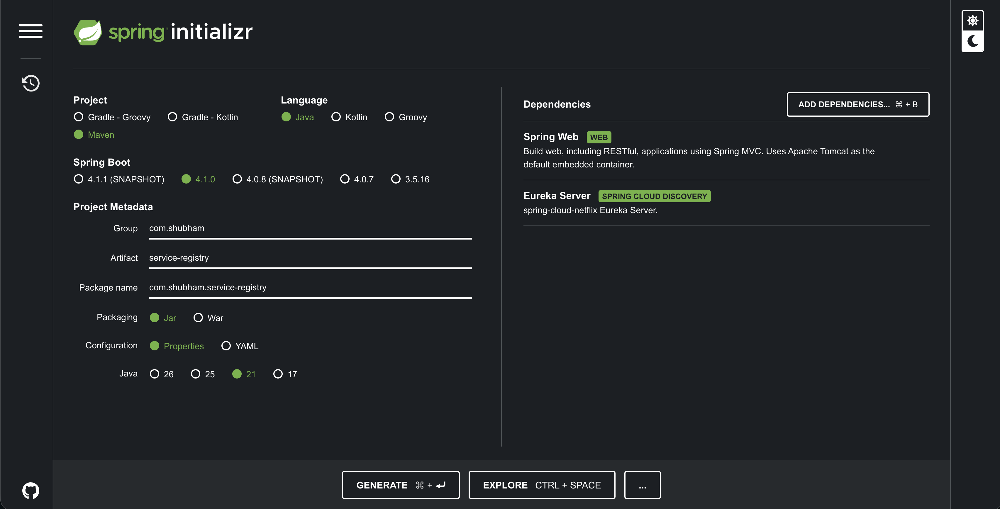
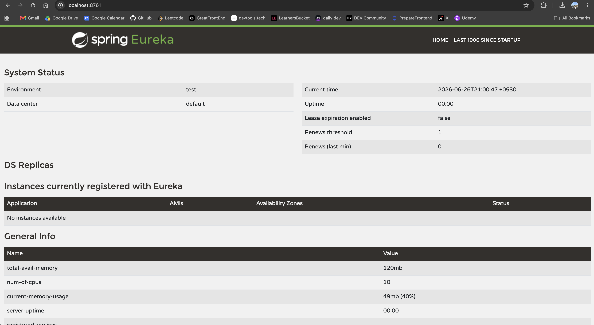

# Service Registry (Netflix Eureka Server)




This project serves as a **Service Discovery Registry** in a microservices architecture.

---

## 1. What is a Service Discovery Registry?

In a microservices architecture, you might have dozens or hundreds of small, independent applications (services) running across different ports or servers.

A **Service Registry** is essentially a "phone book" or "directory" for these microservices.

- When a microservice starts up, it connects to the Service Registry and registers its own details (Application Name, IP Address, Port).
- When **Service A** needs to communicate with **Service B**, it doesn't need to know Service B's hardcoded IP or port. Instead, it asks the Service Registry: _"Where can I find Service B?"_ The registry provides the address, allowing them to communicate.

This makes the system incredibly dynamic. If you spin up 5 instances of a User Service, they all register themselves, and the registry handles the load balancing and routing automatically!

---

## 2. What is Eureka?

**Eureka** is a service discovery tool originally built by Netflix. Spring Cloud integrates seamlessly with it through the **Spring Cloud Netflix** project.

In a Eureka architecture, there are two main components:

1. **Eureka Server**: This is the central registry (this exact project).
2. **Eureka Client**: Any microservice that connects to the server to register itself or find other services.

---

## 3. How to Set Up the Eureka Server (This Project)

To turn a standard Spring Boot application into a Eureka Server, two things are required:

### The Code

You must add the `@EnableEurekaServer` annotation to your main application class.

```java
import org.springframework.boot.SpringApplication;
import org.springframework.boot.autoconfigure.SpringBootApplication;
import org.springframework.cloud.netflix.eureka.server.EnableEurekaServer;

@SpringBootApplication
@EnableEurekaServer // <-- This annotation does all the magic!
public class ServiceRegistryApplication {
    public static void main(String[] args) {
        SpringApplication.run(ServiceRegistryApplication.class, args);
    }
}
```

### The Properties (`application.properties`)

```properties
# Standard default port for Eureka Server
server.port=8761

# Tell this app NOT to register itself as a client (since it is the server)
eureka.client.register-with-eureka=false

# Tell this app NOT to fetch the registry from itself
eureka.client.fetch-registry=false
```

---

## 4. How to Set Up a Eureka Client (Other Microservices)

When you build _other_ microservices (e.g., an Order Service or a Payment Service) and want them to connect to this registry, here is what the client has to write:

### The Dependencies (`pom.xml`)

The client must explicitly include the Eureka Client dependency in its `pom.xml`.

```xml
<dependency>
    <groupId>org.springframework.cloud</groupId>
    <artifactId>spring-cloud-starter-netflix-eureka-client</artifactId>
</dependency>
```

### The Code

In modern Spring Cloud versions, simply adding the above dependency in the `pom.xml` is enough. However, you can explicitly enable it using the `@EnableDiscoveryClient` annotation on the client's main class.

```java
import org.springframework.boot.SpringApplication;
import org.springframework.boot.autoconfigure.SpringBootApplication;
import org.springframework.cloud.client.discovery.EnableDiscoveryClient;

@SpringBootApplication
@EnableDiscoveryClient // <-- Tells this microservice to act as a client
public class PaymentServiceApplication {
    public static void main(String[] args) {
        SpringApplication.run(PaymentServiceApplication.class, args);
    }
}
```

### The Properties (`application.properties`)

The client must declare its own name and tell Spring Boot where the Eureka Server lives.

```properties
# 1. Give the microservice a unique name.
# This is the name it will use to register in the Eureka phone book.
spring.application.name=payment-service

# 2. Tell the client where the Eureka server (this project) is running.
eureka.client.serviceUrl.defaultZone=http://localhost:8761/eureka/
```
