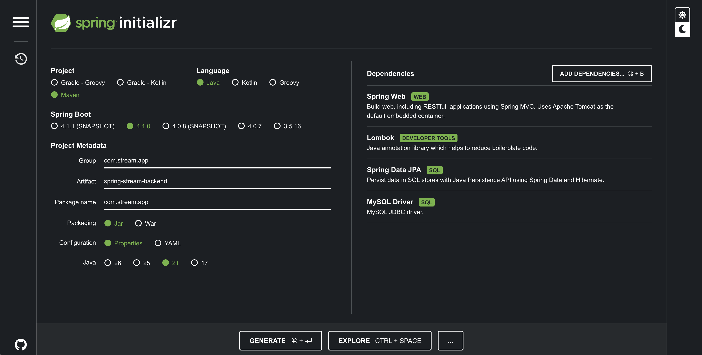
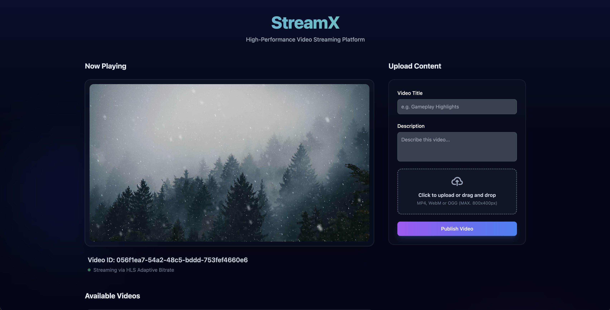
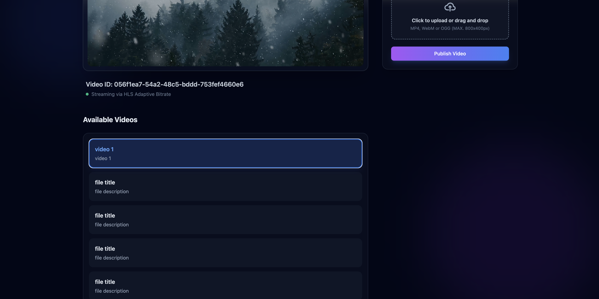
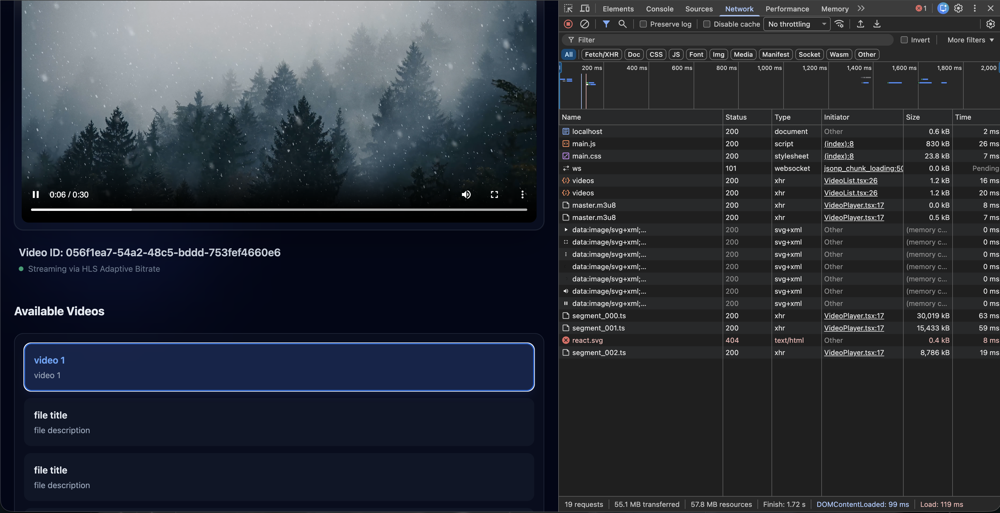
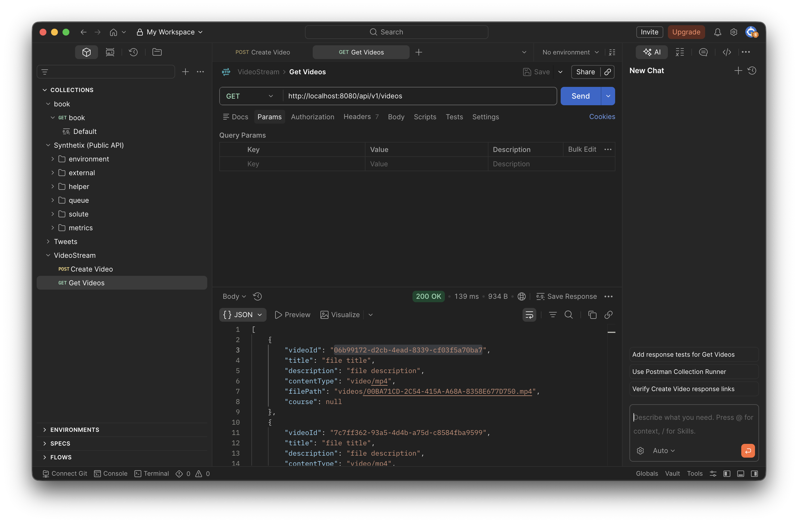
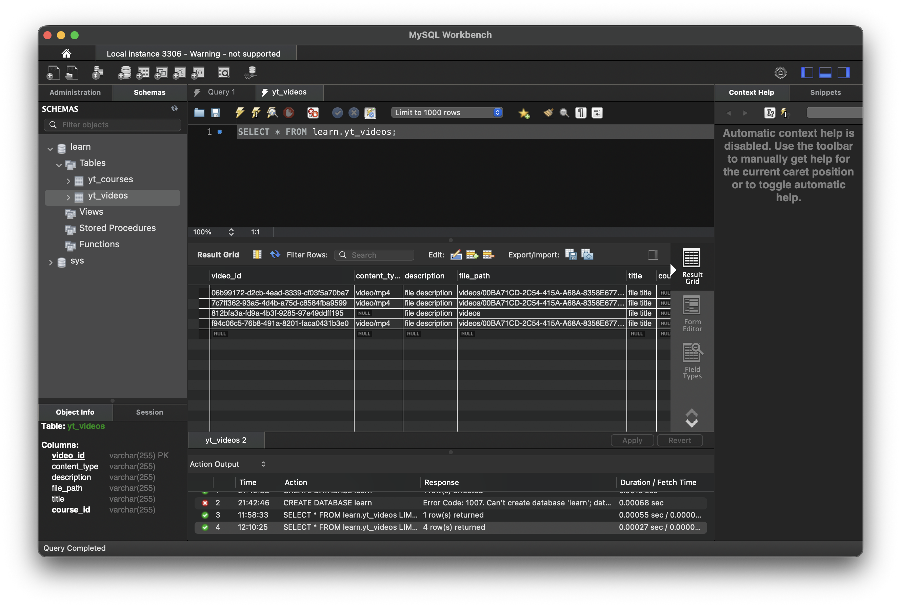
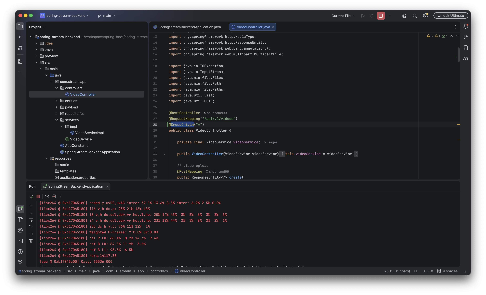

# Spring Boot Video Streaming Backend (StreamX)

This is the backend service for the StreamX video streaming application. It is built using Java and Spring Boot. This repository handles video uploads, metadata storage, dynamic video processing (transcoding to HLS using FFmpeg), and serving video chunks to the frontend.

> 🔗 **Frontend Repository:** [React StreamX Frontend](https://github.com/shubhamd99/react/tree/main/video-stream-app)

<br/>



### UI Previews








---

## 🚀 Quick Start

1. **Prerequisites:** Ensure you have Java 17+ and Maven installed. You also **MUST** have `ffmpeg` installed on your system path (e.g., `brew install ffmpeg` on macOS), as it is required for video processing.
2. **Database:** Ensure your database (e.g., MySQL or PostgreSQL, depending on `application.properties`) is running.
3. **Run the Application:**
   ```bash
   ./mvnw spring-boot:run
   ```
   The API will be available at `http://localhost:8080`.

---

## 📂 Project Structure

This project follows a classic, clean Spring Boot layered architecture to separate concerns efficiently:

```text
src/main/java/com/stream/app/
├── controllers/          # Defines REST APIs and handles incoming HTTP requests
│   └── VideoController.java
├── entities/             # Domain models mapped directly to database tables
│   ├── Course.java
│   └── Video.java
├── payload/              # Data Transfer Objects (DTOs) for formatted API responses
│   └── CustomMessage.java
├── repositories/         # Spring Data JPA interfaces for database CRUD operations
│   └── VideoRepository.java
└── services/             # Core business logic (FFmpeg processing, file I/O)
    ├── VideoService.java
    └── impl/
        └── VideoServiceImpl.java
```

---

## 🛠 Tech Stack & Architecture (Learning Guide)

If you are learning Spring Boot or preparing for an interview, here is a breakdown of the key technologies and design decisions used in this project.

### 1. Spring Web (REST API)

- **What it does:** Provides the `@RestController` annotations to expose HTTP endpoints (`/api/v1/videos`).
- **Why it's used:** It's the industry standard for building robust, scalable REST APIs in Java. We use `@CrossOrigin("*")` on the controller to prevent CORS (Cross-Origin Resource Sharing) blocks when our React frontend (running on port 3000) tries to fetch data from our API (running on port 8080).

### 2. Spring Data JPA & Hibernate

- **What it does:** Maps Java objects (Entities) to relational database tables.
- **Why it's used:** Instead of writing raw SQL queries, we extend `JpaRepository<Video, String>`. This automatically provides built-in methods like `save()`, `findAll()`, and `findById()` to manage our `Video` metadata (title, description, file paths) in the database effortlessly.

### 3. Multipart File Uploads

- **What it does:** Handles incoming binary data from HTTP POST requests.
- **Why it's used:** When a user uploads a video on the frontend, Spring automatically parses the multipart form data and provides a `MultipartFile` object to our service layer. We then use `java.nio.file.Files.copy()` to save this stream directly to the local filesystem (`videos/` directory).

### 4. Dynamic Process Execution (`ProcessBuilder`)

- **What it does:** Runs external system commands directly from Java.
- **Why it's used (The FFmpeg Bridge):** Java itself is not designed to transcode video. Instead of reinventing the wheel, we use `ProcessBuilder` in `VideoServiceImpl` to spin up a terminal shell and execute the `ffmpeg` command-line tool. This command takes the raw uploaded `.mp4` file and heavily transcodes it into HTTP Live Streaming (HLS) format.

### 5. Serving Static Resources (`FileSystemResource`)

- **What it does:** Streams files from the server's hard drive directly to the HTTP response.
- **Why it's used:** When the frontend requests a specific `.ts` video chunk, our controller uses `@GetMapping("/{videoId}/{segment}.ts")` to locate the file on disk and returns a `ResponseEntity<Resource>`. This is highly efficient and tells Spring to pipe the bytes directly to the client without loading the entire file into Java's RAM.

### 6. Application Configuration (`@Value`)

- **What it does:** Injects configuration properties from `application.properties` directly into Java variables.
- **Why it's used:** Hardcoding folder paths for video uploads is a bad practice. By using `@Value("${files.video}")`, we can dynamically change where videos are saved (e.g., local disk in dev, mounted NAS in prod) just by editing the properties file, without touching the Java code.

---

## 🎥 Video Streaming Concepts (HLS & FFmpeg)

The true power of this backend lies in how it processes video. We don't just serve static MP4 files; we implement **Adaptive Bitrate Streaming**.

### How we use FFmpeg

When a video is uploaded, our Java code triggers an FFmpeg command that looks roughly like this:

```bash
ffmpeg -i "input.mp4" -c:v libx264 -c:a aac -f hls -hls_time 10 -hls_segment_filename "segment_%03d.ts" "master.m3u8"
```

- **`-i "input.mp4"`**: Takes the original uploaded video.
- **`-c:v libx264 -c:a aac`**: Forces the video to be encoded in H.264 and audio in AAC (the most universally supported web codecs).
- **`-f hls -hls_time 10`**: Tells FFmpeg to slice the video into multiple 10-second chunks (`.ts` files).
- **`master.m3u8`**: Generates a text "manifest" or "playlist" file that tells the browser where to find all the generated chunks.

### Why do we do this?

If we just served a 500MB MP4 file, a user on a slow mobile connection would have to wait 5 minutes for the video to buffer before it starts playing.

By slicing the video into 10-second `.ts` chunks, the frontend player (using `Hls.js`) only needs to download the first tiny chunk to start playback instantly. As the video plays, it quietly downloads the next chunks in the background. If the user's internet slows down, an advanced FFmpeg setup can even generate lower-resolution chunks (e.g., 480p) so the player can switch quality seamlessly without the video ever stopping to buffer!
