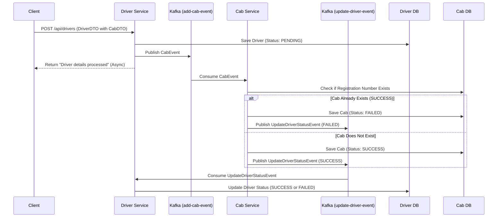

# Taxi Booking App

## Overview
The Taxi Booking App is an event-driven microservices-based application built using Spring Boot. It demonstrates a distributed architecture handling driver registration and cab assignment. The system uses **Kafka** for asynchronous communication (Choreography Saga pattern) and **MySQL** for data persistence.

The project is divided into three main modules:
- **`driver-service`**: Manages driver information, exposes REST APIs for driver onboarding, and orchestrates the driver registration saga.
- **`cab-service`**: Manages cab (vehicle) inventory, listens for cab assignment requests, validates them, and persists cab details.
- **`common-dtos`**: A shared library containing Data Transfer Objects (DTOs), events, and enums used by both services to ensure data consistency during messaging.

---

## Architecture & Flow

The system employs an **Event-Driven Architecture** to ensure loose coupling between microservices. When a new driver registers along with their cab details, a distributed transaction ensures that either both the driver and cab are registered successfully, or the failure is properly handled.

### Flow Diagram

Here is a visual representation of how the components connect and interact:

---

## What is What & Connections

### 1. **Driver Service (`driver-service`)**
- **Role**: Handles driver-related REST requests.
- **Components**:
  - `DriverController`: Exposes endpoints (`GET /api/drivers`, `POST /api/drivers`, etc.).
  - `DriverService`: Contains business logic. When saving a new driver, it sets the status to `PENDING` and publishes a `CabEvent`.
  - `DriverListener`: Listens to the `update-driver-event` Kafka topic to update the driver's status to `SUCCESS` or `FAILED`.
- **Connections**: Connects to the Driver MySQL Database and Kafka broker.

### 2. **Cab Service (`cab-service`)**
- **Role**: Manages cab data and processes cab assignment requests from the driver service.
- **Components**:
  - `CabController`: Exposes endpoints to retrieve/manage cabs (`GET /api/cabs`).
  - `CabListener`: Consumes `add-cab-event` from Kafka. It validates if the cab's registration number already exists. Depending on the validation, it saves the cab as `SUCCESS` or `FAILED` and publishes the outcome to `update-driver-event`.
  - `CabService`: Handles validation and database interactions.
- **Connections**: Connects to the Cab MySQL Database and Kafka broker.

### 3. **Common DTOs (`common-dtos`)**
- **Role**: Shared module for common structures.
- **Components**:
  - **DTOs**: `DriverDTO`, `CabDTO`.
  - **Events**: `CabEvent` (payload for `add-cab-event`), `UpdateDriverStatusEvent` (payload for `update-driver-event`).
  - **Enums**: `CommonStatus` (`PENDING`, `SUCCESS`, `FAILED`).
- **Connections**: Included as a Maven dependency in both `driver-service` and `cab-service`.

### 4. **Kafka (Message Broker)**
- Acts as the central nervous system connecting `driver-service` and `cab-service` asynchronously.
- **Topics**: 
  - `add-cab-event`: Written by Driver Service, read by Cab Service.
  - `update-driver-event`: Written by Cab Service, read by Driver Service.

### 5. **MySQL Database**
- Persists data securely. `driver-service` and `cab-service` interact with MySQL via Spring Data JPA to store their respective `Driver` and `Cab` entities.

---

## Technologies Used
- **Java 21**
- **Spring Boot 4.1.0** (Web, Data JPA)
- **Spring Kafka** for messaging
- **MySQL** (Relational Database)
- **Lombok** (Code reduction)
- **Swagger UI** (API documentation)
